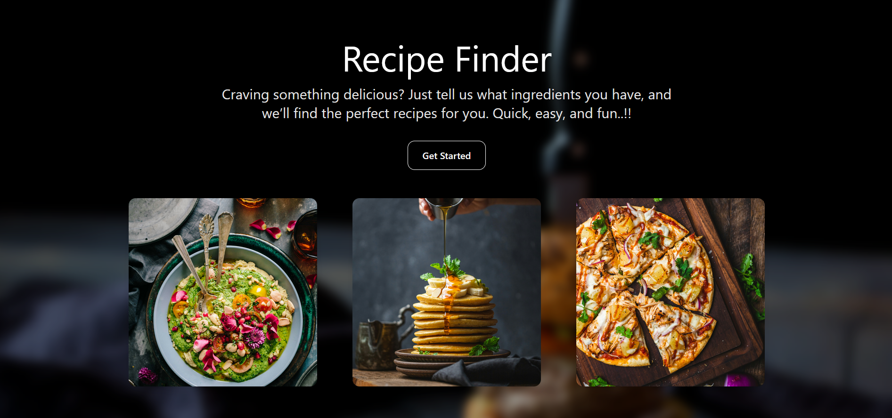
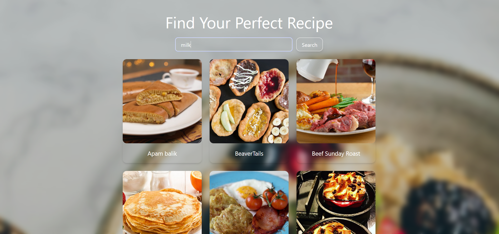
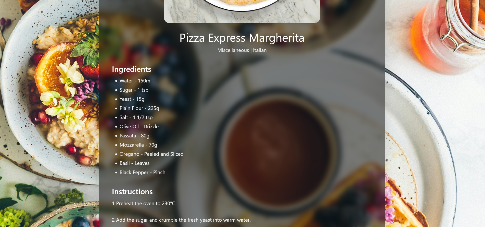

# 🍽️ Recipe Finder App

## Overview

A simple and responsive web application to search delicious recipes based on ingredients!  
Built using **React + Tailwind CSS + TheMealDB API**.

## 🚀 Live Demo

1. Netlify Deployed Link :

> 🔗 https://recipefinder-acs.netlify.app/

2. CodeSandBox Deployed Link :

> 🔗 https://m877hh-5173.csb.app/

## 📸 Screenshots

### Home Page


### Recipe Page


### Recipe Details Page


## ✨ Features

- 🔍 Search recipes by ingredient
- 📱 Fully responsive design
- 🖼️ Beautiful recipe card grid layout
- ➕ Click on any recipe to view more details
- 💡Extensible for additional experiments or integrations

## 🛠️ Tech Stack

- React         - UI development
- Tailwind CSS  - Styling & responsiveness
- React Router  - Navigation
- TheMealDB API - Recipe data

## 📋 Requirements

- Git
- A runtime and package manager appropriate for the project :
    - Node.js (>=14) and npm/yarn

## 📦 Getting started

1. Clone the repo
```bash
git clone https://github.com/<your-org>/Recipe-Finder.git
cd AganithaCognitiveAssignment
```

2. Install dependencies

Node.js
```bash
npm install
# or
yarn install
```

## 🚀 Running

Node.js
```bash
npm run dev
```

## 📁 Project structure

- public/             — Images
- src/                — Source code
- components/         — Reusable UI components
- pages/              — Application pages & UI screens
- App.jsx             — Root component
- main.jsx            — Entry point
- README.md           — Project documentation

## 🔗 CodeSandbox Repo Link

> 🔗 https://codesandbox.io/p/github/Ankur0301/Recipe-Finder

## 🔗 GitHub Repo Link

> 🔗 https://github.com/Ankur0301/Recipe-Finder

## 🎬 YouTube Video Link

> 🔗 https://youtu.be/2x37NSZq-Co

## 👨‍💻 Author

**Ankur Agrawal**  
- GitHub : **[Ankur0301](https://github.com/Ankur0301)**  
- LinkedIn : **https://www.linkedin.com/in/ankur-agrawal-/** 
- Email : **agrank1020@gmail.com** 
